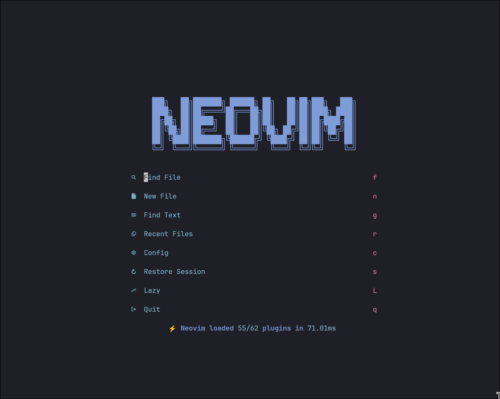
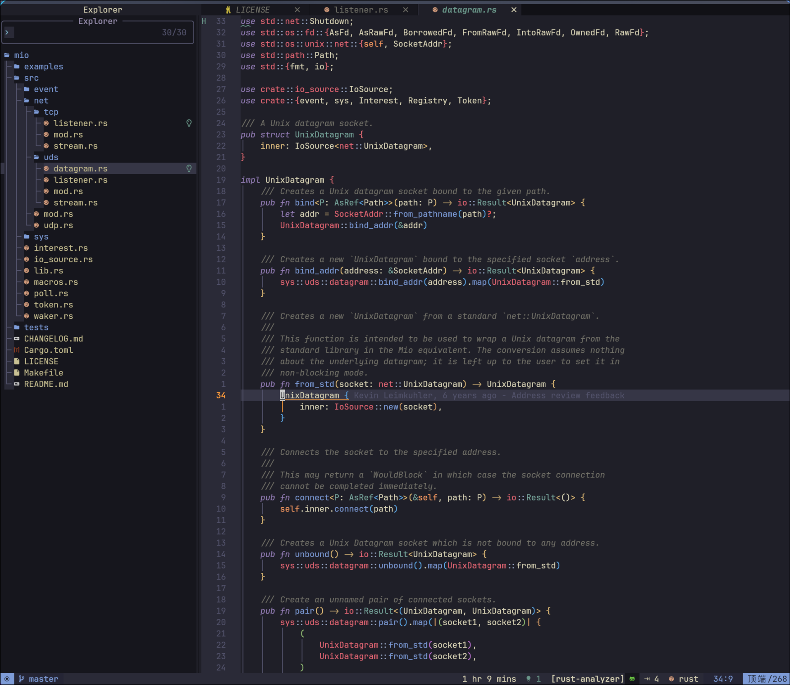
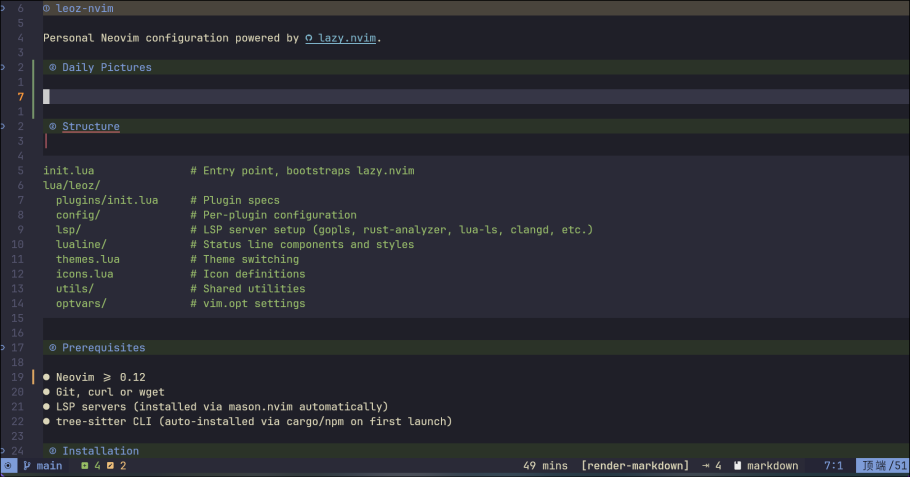
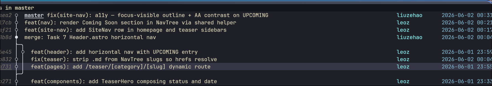
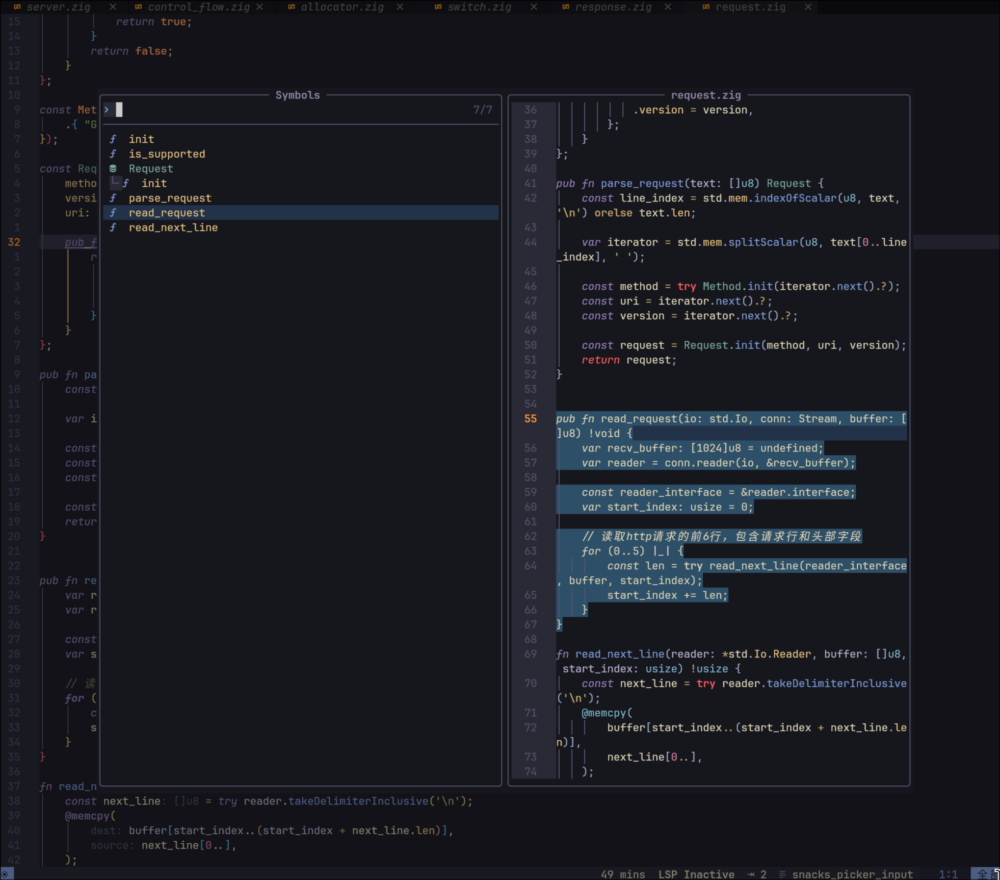
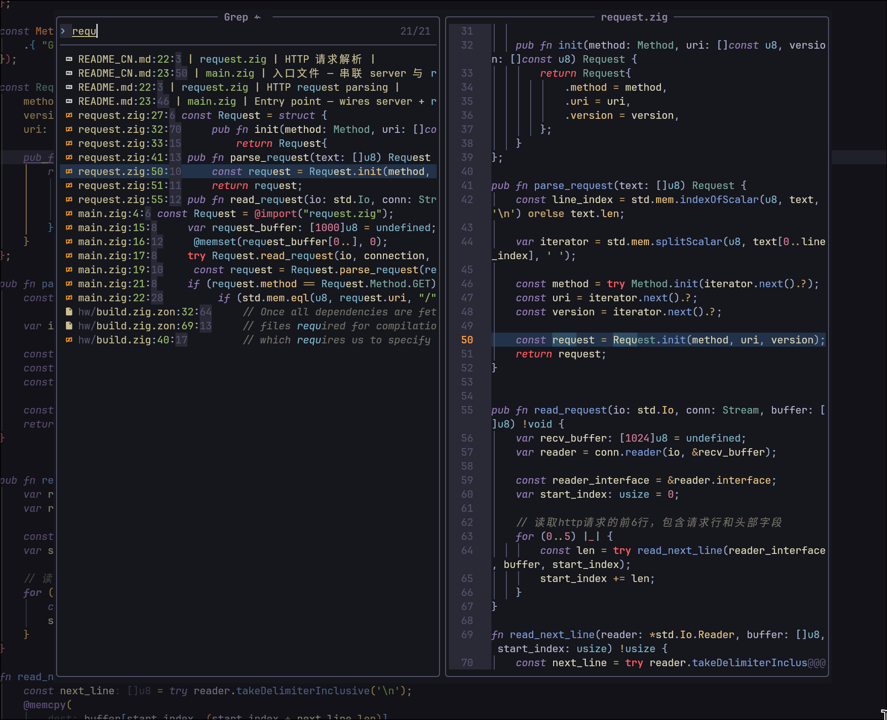
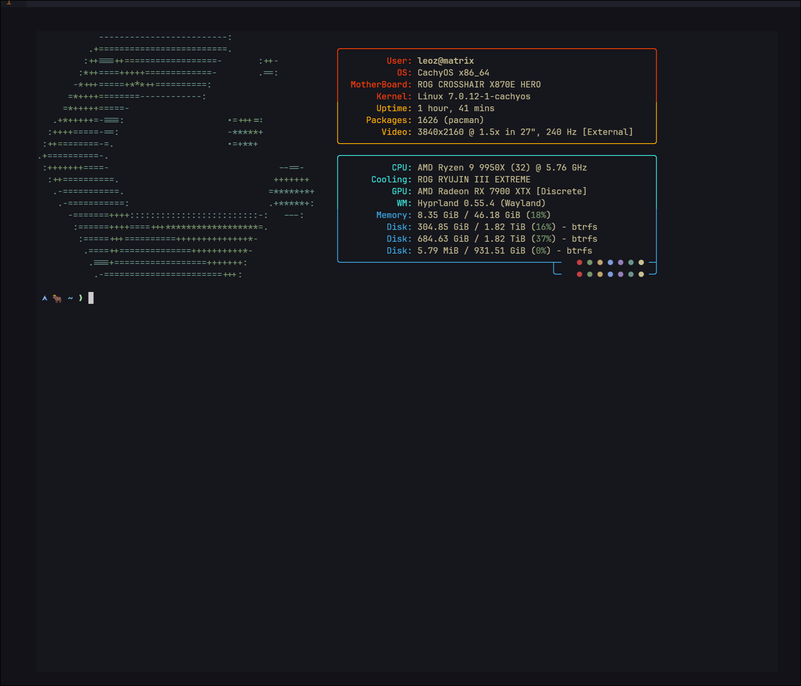

# leoz-nvim

Personal Neovim configuration powered by [lazy.nvim](https://github.com/folke/lazy.nvim).

## Daily Pictures

### DashBoard



### Explorer



### Markdown-render



### Neogit



### Symbols List



### Text Search




### Toggle-Term



### And More...

| Feature | Plugin | Description |
|---------|--------|-------------|
| Tree-sitter | nvim-treesitter | Auto-install parsers for lua, go, rust, python, c/c++, js/ts, html/css, toml, yaml, json, markdown |
| Rainbow Brackets | rainbow-delimiters | Each bracket pair gets a distinct color for instant visual nesting |
| Inline Diagnostics | tiny-inline-diagnostic | Errors/warnings on the line, no virtual text clutter |
| DAP Debugging | nvim-dap + nvim-dap-ui | Breakpoints, step through, watch variables, REPL — all inside Neovim |
| EasyMotion | vim-easymotion | Jump to any visible character in 2-3 keystrokes |
| Code Folding | nvim-ufo | Modern fold with virtual text preview of folded content |
| Yank History | yanky.nvim | Ring-buffer clipboard, picker browse via `<Leader>p` |
| Todo Comments | todo-comments | TODO/FIXME/HACK/NOTE/PERF/WARNING highlighted, `<Leader>tt` to quickfix |
| Git Signs | gitsigns | Added/modified/removed signs, inline blame, hunk staging |
| Color Preview | nvim-colorizer | Hex/rgb/hsl codes shown in their actual color inline |
| Cursor Word HL | vim-illuminate | All occurrences of word under cursor highlighted |
| Rust Crates | crates.nvim | Latest version + out-of-date warnings inline in Cargo.toml |

> **Note:** Tree-sitter requires `cargo` or `npm` to auto-install the CLI on first launch.

## Keybindings

Leader key is `<Space>`.

| Key | Description |
|-----|-------------|
| `jk` | Escape (insert mode) |
| `<Leader>h` | Clear search highlight |
| `<Leader>e` | Toggle file explorer |
| `<Leader>E` | Reveal file in explorer |
| `<Leader>sf` | Find file |
| `<Leader>sb` | Find buffer |
| `<Leader>st` | Grep/search text |
| `<Leader>sd` | Find diagnostics |
| `<Leader>sp` | Pick colorscheme |
| `<Leader>sk` | Find keymap |
| `<Leader>si` | Insert icon |
| `<Leader>o` | Symbol outline (aerial) |
| `<Leader>ti` | Toggle LSP inlay hints |
| `<Leader>tt` | Todo quickfix list |
| `<Leader>gg` | Neogit |
| `<Leader>lg` | LazyGit |
| `<Leader>z` | Zen mode |
| `<Leader>p` | Yank history picker |
| `<Leader>Lc` | Edit nvim config |
| `s` | EasyMotion jump |
| `<Leader>f` | EasyMotion cross-window jump |
| `<M-r>` | Floating terminal |
| `<M-w>` | Bottom terminal |
| `<M-e>` | Right terminal |
| `<Leader>dt` | Toggle breakpoint |
| `<Leader>dc` | Start/continue debug |
| `<Leader>di` | Step into |
| `<Leader>do` | Step over |
| `<Leader>du` | Toggle DAP UI |

## Structure

```
init.lua               # Entry point, bootstraps lazy.nvim
lua/leoz/
  plugins/init.lua     # Plugin specs
  config/              # Per-plugin configuration
  lsp/                 # LSP server setup (gopls, rust-analyzer, lua-ls, clangd, etc.)
  lualine/             # Status line components and styles
  themes.lua           # Theme switching
  icons.lua            # Icon definitions
  utils/               # Shared utilities
  optvars/             # vim.opt settings
```

## Prerequisites

- Neovim >= 0.12
- Git, curl or wget
- LSP servers (installed via mason.nvim automatically)
- tree-sitter CLI (auto-installed via cargo/npm on first launch)

## Installation

```bash
git clone https://github.com/niT-Tin/leoz-nvim.git ~/.config/nvim
nvim
```

## Plugins

| Category | Highlights |
|----------|-----------|
| Completion | blink.cmp + blink-copilot |
| AI | Copilot.lua, CopilotChat.nvim |
| LSP | nvim-lspconfig, mason.nvim, crates.nvim |
| Treesitter | nvim-treesitter, nvim-treesitter-context |
| UI | bufferline, lualine, noice, snacks, tokyonight |
| Navigation | aerial, nvim-ufo, vim-easymotion |
| Git | gitsigns, neogit |
| DAP | nvim-dap, nvim-dap-ui |
| Languages | vim-go, rustaceanvim |
| Editing | nvim-autopairs, mini.nvim, hardtime, yanky |
